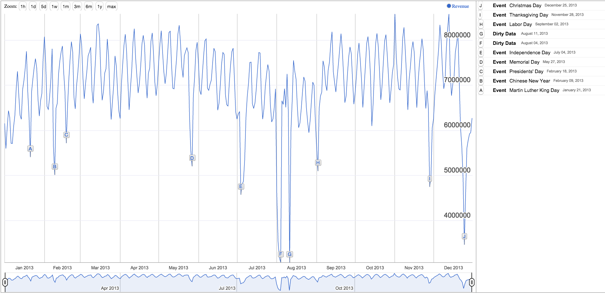
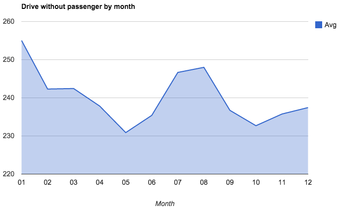
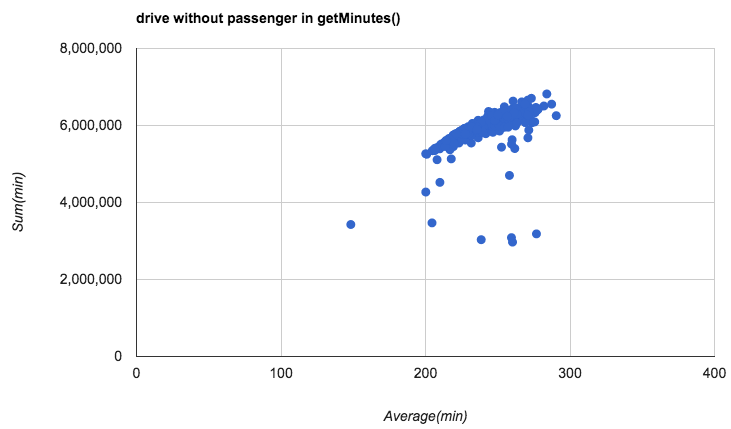
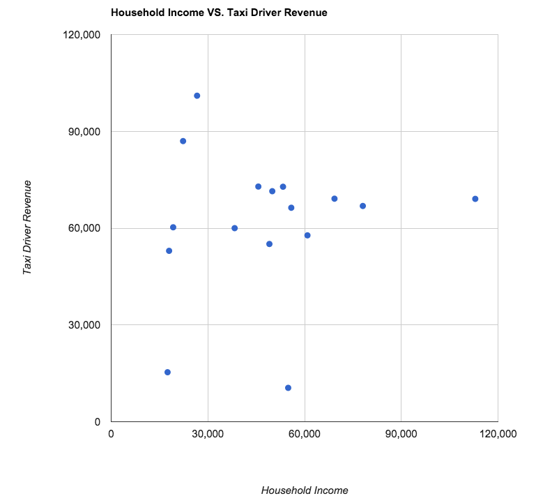
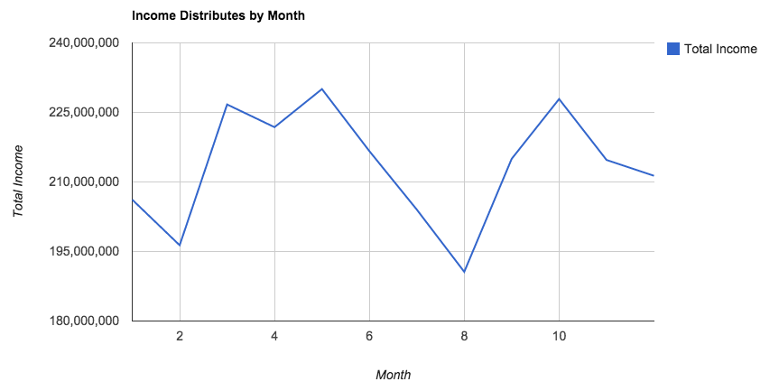
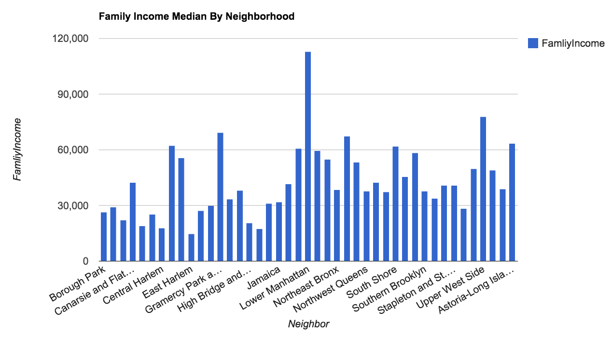
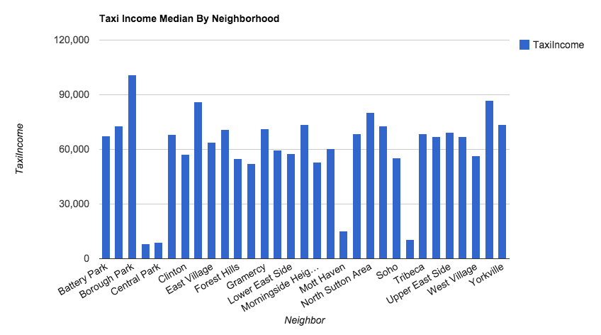
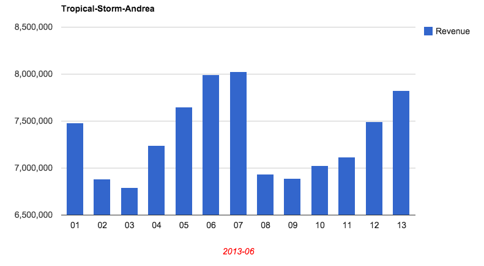
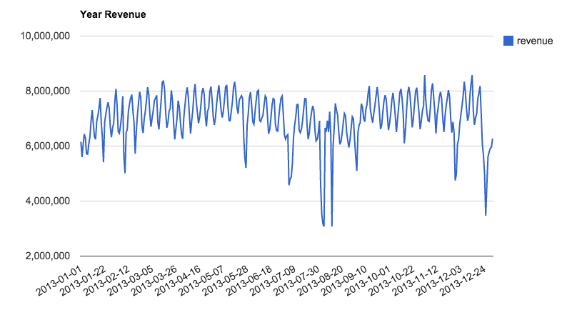

# NYC-Taxi-Data-Analysis

In this final group project we analyze NYC taxi data on topic of "Understanding Taxi Economics", it is implemented in Map-Reduce Algorithm with Hadoop Streamming API and Python.

# Question Investigated 
1. How does revenue vary across neighborhoods and how does it correlate with the median household income in the neighborhood?
2. How does revenue vary over time? Are the months or seasons when taxi companies make more (or less) money?
3. How long do cab drives ride without passengers? How does this vary over time?
4. Are revenues affected during major events? E.g., parades, presidential visits, storms

# Data Source 
2013 Taxi data 
Trip data: http://chriswhong.com/wp-content/uploads/2014/06/nycTaxiTripData2013.torrent 
Fare data: http://chriswhong.com/wp-content/uploads/2014/06/nycTaxiFareData2013.torrent 

Census data 
Demographics: http://www.nyc.gov/html/dcp/html/census/demo_tables_2010.shtml 
Income information: http://www.nyc.gov/html/dcp/html/census/socio_tables.shtml 
Shape files for census tracts: http://www.nyc.gov/html/dcp/html/bytes/districts_download_metadata.shtml (search for "tract") 

Weather data 
http://www.ncdc.noaa.gov/data-access/land-based-station-data/land-based-datasets 
http://www7.ncdc.noaa.gov/CDO/dataproduct  -- select "Surface Data, Hourly Global", and then when it comes to select the region, choose NY and the three main stations (Central Park, JFK and LaGuardia).

# Result Snapshot

    

 
   

    

    

    

# Author
Shaopeng Zhang 
Hao Chen 
Guang Xiong 
